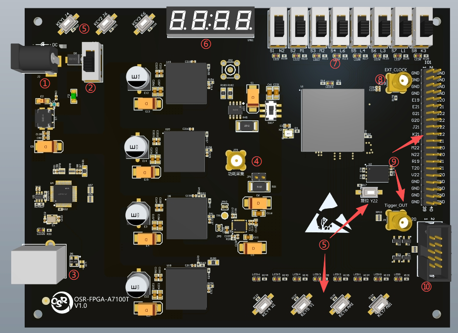
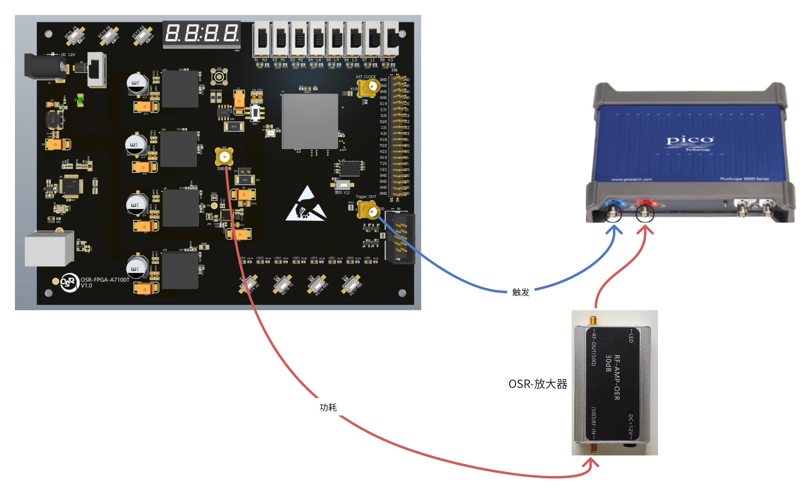

# OSR-FPGA-A7100T Hardware Security Evaluation Board
> If this experimental platform is helpful to your research and experiments, we would greatly appreciate it if you could cite this project in your papers and recommend it to others!

The OSR-FPGA hardware security evaluation board is a development and evaluation board customized specifically for hardware security experiments. It lets you quickly build a side-channel analysis environment for cryptographic algorithms, and study and experiment with related topics.

The core of the OSR-FPGA evaluation board is the XC7A100T chip. The board carries an FT232 chip, so a single USB cable is enough for both power supply and communication, greatly simplifying the effort of setting up the environment.

The main specifications of the OSR-FPGA evaluation board are listed in the table below:

| Processor | XC7A100T-2FGG484C |
| :------- | :------------ |
| Supply voltage |   5V          |
| Configuration flash    | 16MB         |
| Crystal     | 50MHz          |

## Hardware Interfaces
The board's interfaces are described in the table below. The location of each interface corresponds to the numbered labels in the figure below.

| No.  | Interface               | Description                                                                  |
| :--- | :----------------- | :-------------------------------------------------------------------- |
| 1    | Power port            | 5V power input, current no less than 1.5A            |
| 2    | Power switch            | Selects between USB power and external power; when USB-powered with no external supply connected, it controls power-cycling the whole board            |
| 3    | USB port            | USB power and communication port, with an FT232 USB-to-serial bridge chip            |
| 4    | Side-channel power collection port          | Collection port for the chip core's operating power           |
| 5    | User button          | Tactile button           |
| 6    | Seven-segment display          | Seven-segment display tube           |
| 7    | Toggle switch          | Toggle (slide) switch           |
| 8    | External clock input port          | External clock input port           |
| 9    | GPIO port          | Breaks out 24 GPIO pins plus one SMA port; the silkscreen matches the chip pins           |
| 10    | JTAG port          | Debug port used for program download and debugging           |

## Side-Channel Acquisition
The principle of power acquisition is to place a sampling resistor in series with the chip's core supply rail. As the chip performs computations, current flows through the sampling resistor and produces a voltage drop across it; acquiring this voltage drop reflects the chip's power consumption.

The side-channel power collection port on the OSR-FPGA can be used to acquire voltage/power traces.

## Clock Fault Injection
Clock fault injection introduces illegal clock glitches while the chip is running, disturbing its normal operation and producing errors.

The external clock input port on the OSR-FPGA can be used for clock fault injection.

## Configuration Flash

The configuration flash used by the OSR-FPGA programming circuit is shown below

## Additional Documentation
- [Vivado Usage Guide](vivado-guide.md) - how to build and program the example projects
- [Side-Channel Analysis Example](sca-example.ipynb) - a complete trace acquisition and analysis walkthrough
