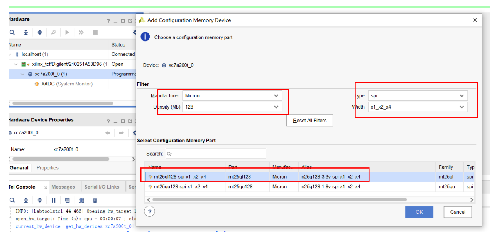

# OSR-FPGA-A7100T Vivado Usage Guide

This guide uses the AES-128 project as an example to walk through the complete FPGA development flow with Vivado on the OSR-FPGA-A7100T evaluation board (XC7A100T-2FGG484C).

---

## Table of Contents

1. [Development Environment Setup](#1-development-environment-setup)
2. [Creating a New Project](#2-creating-a-new-project)
3. [Importing an Existing Project](#3-importing-an-existing-project)
4. [Writing Verilog Code](#4-writing-verilog-code)
5. [Writing Constraint Files (XDC)](#5-writing-constraint-files-xdc)
6. [Simulation](#6-simulation)
7. [Synthesis and Implementation](#7-synthesis-and-implementation)
8. [Programming the Bitstream](#8-programming-the-bitstream)
9. [Serial Port Debugging](#9-serial-port-debugging)
10. [FAQ](#10-faq)

---

## 1. Development Environment Setup

### Software

| Software | Description |
|------|------|
| Vivado 2025.2+ | AMD's official FPGA development tool; Artix-7 device support is required |
| FT232 driver | The board uses an FT232HL for USB-to-serial, so the FTDI driver must be installed |
| Serial tool | PuTTY, SecureCRT, or Python pyserial is recommended |

### Hardware Connection

```
12V power supply -> Power port (1)
USB cable        -> USB port (3)   <- serial communication (FT232)
JTAG cable       -> JTAG port (10) <- program download (Xilinx Platform Cable / Digilent JTAG)
```

After powering the board, turn on the power switch (2) and confirm the power indicator LED is lit.

---

## 2. Creating a New Project

### 2.1 Start the Wizard

1. Open Vivado → **File → Project → New**
2. Enter a project name (e.g. `aes`) and a save location
3. Select **RTL Project** and check **Do not specify sources at this time** (sources are added later)

### 2.2 Select the Device

On the Default Part page:

| Parameter | Value |
|------|-----|
| Family | Artix-7 |
| Package | fgg484 |
| Speed Grade | -2 |
| Part | **xc7a100tfgg484-2** |

> You can also type `xc7a100tfgg484-2` directly into the search box.

### 2.3 Add Source Files

After the project is created:

1. Click **+ (Add Sources)** in the **Sources** window
2. Choose **Add or create design sources**
3. Click **Add Files** or **Create File**
4. **Leave** "Copy sources into project" **unchecked** to avoid creating an `imports/` level
5. If you check "Copy sources into project", the files are copied into `<project>.srcs/sources_1/imports/`

### 2.4 Add Constraint Files

1. **Add Sources → Add or create constraints**
2. Add the `.xdc` file

### 2.5 Project Directory Structure

Once created, the recommended directory structure is:

```
aes/
├── aes.xpr                     ← Vivado project file
├── aes.srcs/
│   ├── sources_1/              ← design sources
│   │   ├── aes128.v
│   │   ├── recv_data.v
│   │   ├── uart.v
│   │   └── ...
│   ├── constrs_1/              ← constraint files
│   │   └── aes.xdc
│   └── sim_1/                  ← simulation files
│       └── tb_aes128.v
├── aes.sim/                    ← simulation output (auto-generated)
├── aes.runs/                   ← synthesis/implementation output (auto-generated)
└── aes.cache/                  ← cache (auto-generated)
```

---

## 3. Importing an Existing Project

### Option 1: Open the .xpr Directly

**File → Project → Open** → select `aes.xpr`

### Option 2: Recreate from Source Files

If you only have `.v` and `.xdc` files, create a new project following section 2 and add the files.

### Option 3: Create with a Tcl Script

Run the following in the Vivado Tcl Console:

```tcl
create_project aes ./aes -part xc7a100tfgg484-2

# Add design sources
add_files -fileset sources_1 ./src/aes128.v
add_files -fileset sources_1 ./src/recv_data.v
add_files -fileset sources_1 ./src/uart.v
add_files -fileset sources_1 ./src/my_uart_rx.v
add_files -fileset sources_1 ./src/my_uart_tx.v
add_files -fileset sources_1 ./src/speed_setting.v

# Add constraint files
add_files -fileset constrs_1 ./constrs/aes.xdc

# Add simulation files
add_files -fileset sim_1 ./sim/tb_aes128.v

# Set the top modules
set_property top recv_data [current_fileset]
set_property top tb_aes128 [get_filesets sim_1]
```

---

## 4. Writing Verilog Code

### 4.1 Module Hierarchy

The module structure of this project:

```
recv_data (top level)
├── uart
│   ├── speed_setting (speed_rx)    ← baud-rate generator (RX)
│   ├── my_uart_rx                  ← UART receiver
│   ├── speed_setting (speed_tx)    ← baud-rate generator (TX)
│   └── my_uart_tx                  ← UART transmitter
└── aes128 (aes_core)
    ├── subword (SubWord)           ← key-expansion S-Box
    ├── subword (iSubWord)          ← inverse key-expansion S-Box
    ├── subbytes (SubBytes)         ← encryption SubBytes
    ├── invsubbytes (InvSubBytes)   ← decryption InvSubBytes
    ├── mixcolumns ×4               ← encryption MixColumns
    └── inv_mixcolumn ×4            ← decryption InvMixColumns
```

### 4.2 Top-Level Port Definitions

The ports of the top module `recv_data` must match the pin names in the XDC constraint file:

```verilog
module recv_data(
    input  wire clk_50m_ext,        // 50MHz clock (R4)
    output wire tx,                  // UART transmit (F14)
    input  wire rx,                  // UART receive (E18)
    input  wire rst,                 // reset button KEY8 (Y22), active low
    output wire busy,                // LED1 (A13)
    output wire key_exp_trigger,     // LED2 (A14)
    output wire enc_start_trigger,   // LED4 (A16)
    output wire wr_en                // LED5 (A18)
);
```

### 4.3 Coding Notes

- All I/O banks on this board use the **LVCMOS33** I/O standard
- The clock comes from the on-board 50MHz crystal on pin R4 (an MRCC pin, so it can drive the global clock network)
- Reset button KEY8 is **pulled up to 3.3V** and reads low when pressed
- The UART baud rate is configured by the `speed_setting` module and defaults to **9600 bps**

---

## 5. Writing Constraint Files (XDC)

XDC files define the FPGA pin assignments, I/O standards, and clock constraints. The core constraints for this board:

```tcl
# ===== Clock =====
# On-board 50MHz crystal -> R4 (MRCC pin)
set_property PACKAGE_PIN R4 [get_ports clk_50m_ext]
set_property IOSTANDARD LVCMOS33 [get_ports clk_50m_ext]
create_clock -period 20.000 -name sys_clk [get_ports clk_50m_ext]

# ===== Reset =====
# KEY8 button, pulled up to 3.3V, reads low when pressed
set_property PACKAGE_PIN Y22 [get_ports rst]
set_property IOSTANDARD LVCMOS33 [get_ports rst]

# ===== UART (FT232HL) =====
# FT232 TX → FPGA RX (E18)
set_property PACKAGE_PIN E18 [get_ports rx]
set_property IOSTANDARD LVCMOS33 [get_ports rx]
# FPGA TX → FT232 RX (F14)
set_property PACKAGE_PIN F14 [get_ports tx]
set_property IOSTANDARD LVCMOS33 [get_ports tx]

# ===== LED =====
set_property PACKAGE_PIN A13 [get_ports busy]
set_property IOSTANDARD LVCMOS33 [get_ports busy]
set_property PACKAGE_PIN A14 [get_ports key_exp_trigger]
set_property IOSTANDARD LVCMOS33 [get_ports key_exp_trigger]
set_property PACKAGE_PIN A16 [get_ports enc_start_trigger]
set_property IOSTANDARD LVCMOS33 [get_ports enc_start_trigger]
set_property PACKAGE_PIN A18 [get_ports wr_en]
set_property IOSTANDARD LVCMOS33 [get_ports wr_en]
```

> Refer to the **TOE_X7CA100T.pdf** schematic for pin assignments. Every port must specify both `PACKAGE_PIN` and `IOSTANDARD`.

---

## 6. Simulation

### 6.1 Add a Testbench

1. **Add Sources → Add or create simulation sources**
2. Add the testbench file (e.g. `tb_aes128.v`)
3. Vivado automatically treats the module without ports as the testbench top

### 6.2 Setting Simulation Parameters

The default simulation time is only 1000ns, which is usually not enough. To change it:

**Option 1: GUI**

**Settings → Simulation → Simulation** tab → set `xsim.simulate.runtime` to `100us` or larger.

**Option 2: Tcl**

```tcl
set_property -name {xsim.simulate.runtime} -value {100us} -objects [get_filesets sim_1]
```

### 6.3 Running the Simulation

**Option 1: GUI**

**Flow Navigator → SIMULATION → Run Simulation → Run Behavioral Simulation**

**Option 2: Tcl Console**

```tcl
launch_simulation
```

Once the simulation is launched, run the whole testbench with:

```tcl
run -all
```

### 6.4 Viewing the Results

- **Tcl Console**: look for the `[PASS]`/`[FAIL]` messages printed by `$display`
- **Waveform window**: inspect signal timing; right-click a signal to change its display format (hexadecimal, etc.)
- If the waveform window is empty, type `add_wave /` in the Tcl Console to add all signals

### 6.5 Testbench Writing Checklist

```verilog
`timescale 1ns / 1ps    // time unit / precision

module tb_aes128;       // no ports

// 1. Declare signals and connect the DUT
reg         clock;
reg         resetn;
wire [127:0] text_out;

// 2. Clock generation (50MHz = 20ns period)
initial clock = 0;
always #10 clock = ~clock;

// 3. Instantiate the module under test
aes128 uut (
    .clock(clock),
    .resetn(resetn),
    // ...
);

// 4. Test stimulus
initial begin
    resetn = 0;
    repeat(5) @(posedge clock);
    resetn = 1;

    // ... test sequence ...

    $finish;
end

// 5. Timeout protection
initial begin
    #1_000_000;
    $display("Timeout!");
    $finish;
end

endmodule
```

---

## 7. Synthesis and Implementation

### 7.1 Synthesis

**Flow Navigator → SYNTHESIS → Run Synthesis**

Or with Tcl:

```tcl
launch_runs synth_1 -jobs 8
wait_on_run synth_1
```

After synthesis, check:
- Warnings in the **Messages** window (especially unconnected ports and unused signals)
- **Utilization Report**: check resource usage
- **Timing Report**: confirm there are no timing violations

### 7.2 Implementation

**Flow Navigator → IMPLEMENTATION → Run Implementation**

Or with Tcl:

```tcl
launch_runs impl_1 -jobs 8
wait_on_run impl_1
```

### 7.3 Generating the Bitstream

**Flow Navigator → PROGRAM AND DEBUG → Generate Bitstream**

Or with Tcl:

```tcl
launch_runs impl_1 -to_step write_bitstream -jobs 8
wait_on_run impl_1
```

The generated `.bit` file is located at:

```
aes.runs/impl_1/recv_data.bit
```

---

## 8. Programming the Bitstream

### 8.1 JTAG Programming (volatile, lost on power-off)

1. Connect the board's JTAG port (10) to your computer with a JTAG cable
2. Power on the board
3. **Flow Navigator → PROGRAM AND DEBUG → Open Hardware Manager → Open Target → Auto Connect**
4. Right-click the FPGA device → **Program Device**
5. Select the `.bit` file → **Program**

With Tcl:

```tcl
open_hw_manager
connect_hw_server
open_hw_target
set_property PROGRAM.FILE {./aes.runs/impl_1/recv_data.bit} [current_hw_device]
program_hw_devices [current_hw_device]
```

### 8.2 Flashing the Configuration Flash (survives power-off)

The board carries a 16MB configuration flash, so the design can be stored permanently and loaded automatically at power-up.

#### GUI Steps

1. Establish the JTAG connection first (steps 1-3 of section 8.1: open the Hardware Manager and Auto Connect)
2. In the Hardware Manager, right-click the FPGA device → **Add Configuration Memory Device**
3. Select the matching flash part in the search dialog (confirm it from the board schematic; commonly something like `s25fl128sxxxxxx0`)
4. The **Program Configuration Memory Device** dialog opens:
   - **Configuration file**: select an `.mcs` or `.bin` file (a `.bit` file cannot be used directly; generate one first, see below)
   - leave the other options at their defaults
5. Click **OK** and wait for programming to finish
6. After programming, power-cycle the board; the FPGA then loads its configuration from flash automatically

#### Generating a BIN File

The projects already enable the `BinFile` option of the `write_bitstream` step in the XPR file, so Generate Bitstream also writes a `.bin` file next to the `.bit` file automatically; no manual conversion is needed.

**To set this manually in the GUI**: **Settings → Implementation → expand write_bitstream** → check **-bin_file** → **OK**.

The equivalent Tcl command:

```tcl
set_property STEPS.WRITE_BITSTREAM.ARGS.BIN_FILE true [get_runs impl_1]
```

#### Generating an MCS File

If you need the `.mcs` format (required by some flash programming tools), run this in the Tcl Console:

```tcl
set bit_file [get_property DIRECTORY [current_run]]/recv_data.bit
set mcs_file [get_property DIRECTORY [current_project]]/recv_data.mcs
write_cfgmem -format mcs -size 16 -interface SPIx4 \
    -loadbit "up 0x0 $bit_file" -file $mcs_file -force
```

> Note: `-interface` must match the `SPI_BUSWIDTH` setting in the XDC file (this board uses SPIx4).

> The flash part number must match the chip actually populated on the board; see the figure below:
>
> 

---

## 9. Serial Port Debugging

### 9.1 Hardware Connection

The board communicates with the PC through the FT232HL (USB port (3)), so no extra serial cable is needed.

### 9.2 Serial Settings

| Parameter | Value |
|------|-----|
| Baud rate | 9600 |
| Data bits | 8 |
| Stop bits | 1 |
| Parity | None |
| Flow control | None |

### 9.3 AES Project Communication Protocol

```
PC → FPGA: send 32 bytes
  ┌──────────────────┬──────────────────┐
  │   Key (16 bytes) │ Plaintext (16 B) │
  └──────────────────┴──────────────────┘
  Big-endian: the first byte is the most significant

FPGA → PC: returns 16 bytes
  ┌──────────────────────┐
  │ Ciphertext (16 bytes)│
  └──────────────────────┘
```

### 9.4 Example Python Debug Script

```python
import serial
import binascii

# Open the serial port (change to your actual port)
ser = serial.Serial('COM3', 9600, timeout=5)

# NIST FIPS-197 test vector
key       = bytes.fromhex('2b7e151628aed2a6abf7158809cf4f3c')
plaintext = bytes.fromhex('3243f6a8885a308d313198a2e0370734')

# Send 32 bytes: key + plaintext
ser.write(key + plaintext)
print(f'Sent key:       {key.hex()}')
print(f'Sent plaintext: {plaintext.hex()}')

# Receive the 16-byte ciphertext
ciphertext = ser.read(16)
print(f'Received cipher: {ciphertext.hex()}')

# Verify
expected = '3925841d02dc09fbdc118597196a0b32'
if ciphertext.hex() == expected:
    print('PASS: Ciphertext matches NIST test vector!')
else:
    print(f'FAIL: Expected {expected}')

ser.close()
```

### 9.5 LED Status Indicators

| LED | Port | Meaning |
|-----|------|------|
| LED1 (A13) | busy | solid on = reset done, system running normally |
| LED2 (A14) | key_exp_trigger | blinking = receiving UART data |
| LED4 (A16) | enc_start_trigger | on = AES encryption in progress |
| LED5 (A18) | wr_en | blinking = transmitting UART data |

Normal flow: LED2 blinks (receive) → LED4 lights up briefly (encrypt) → LED5 blinks (transmit)

---

## 10. FAQ

### Q: Synthesis warns "Port xxx has no load"

The port is not used inside the module. Check whether a signal connection was missed.

### Q: The simulation stops after only 1000ns

Vivado's default simulation runtime is 1000ns. See [Section 6.2](#62-setting-simulation-parameters) to change it.

### Q: The serial port does not respond after programming

- Confirm the FT232 driver is installed and the COM port appears in Device Manager
- Confirm the baud rate is set to 9600
- Press the KEY8 reset button once
- Confirm you sent the full 32 bytes

### Q: JTAG will not connect

- Confirm the JTAG cable is connected correctly and the board is powered
- Try **Auto Connect** in the Hardware Manager
- Check that the Xilinx Cable Driver is installed

### Q: How do I change the baud rate?

Change the parameter in `speed_setting.v`:

```verilog
`define BPS_SET  96    // 9600 bps (value = baud rate / 100)
```

For example, to switch to 115200 bps:

```verilog
`define BPS_SET  1152  // 115200 bps
```

### Q: How do I update the design after flashing it

Regenerate the `.bit` and `.mcs` files and reprogram the flash over JTAG.
